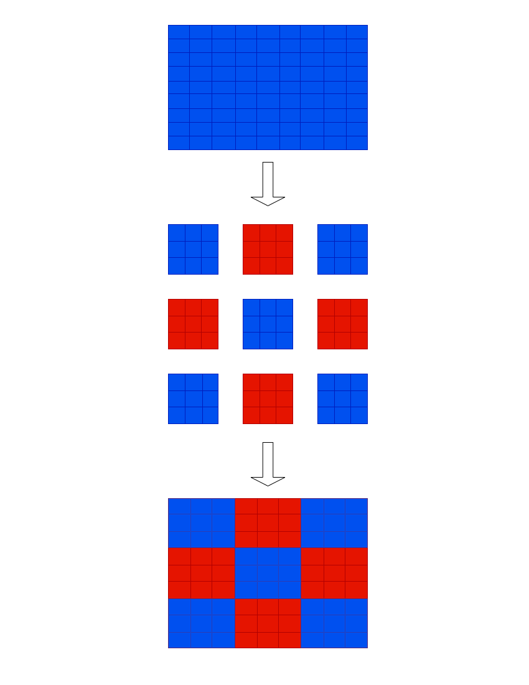

# **TUGAS PRONLEM FORMULATION**
# 

## **Penjelasan**

* Pada state awal ukuran dari state space nya adalah 81!.

* Agar mencapai tujuan, kita harus mempertimbangkan di setiap sub kotak pewarnaannya harus seragam. Setelah kita membagi grid dari 9X9 ke 3X3 sub kotak, maka masalah dan ukuran dari state space nya adalah 9!.

* Untuk Mencapai goal state kita hanya perlu merubah 36 kotak atau 4 sub kotak.